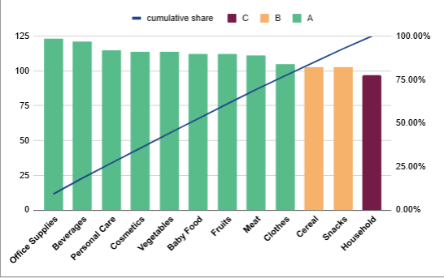
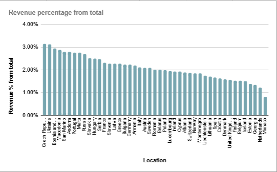

# Sales Insights Dashboard — Google Sheets

**Проєкт для портфоліо**, який демонструє вміння аналізувати бізнес-процеси за допомогою Google Sheets. Створено з метою подачі на позицію **Junior Business Analyst**.

---

## Інструменти
- **Google Sheets** (формули, діаграми, умовне форматування)
- **Візуалізації**: діаграми, зведені таблиці
- **Тип даних**: Продажі — замовлення, товари, країни

---

## Мета проєкту
Проаналізувати дані з продажів та побудувати інтерактивний дашборд для виявлення ключових бізнес-інсайтів. Показати свої навички аналізу, візуалізації та роботи з таблицями.

---

## Основні аналітичні інсайти

-  Категорії товарів з найвищим прибутком
-  Визначення найшвидших і найповільніших способів доставки
-  Аналіз країн за кількістю замовлень та доходом
-  Поведінка покупців за днями тижня
-  Частка категорій у загальному доході
-  Середній чек і прибуток на замовлення

---

##  Дашборд (Google Sheets)

Переглянути у Google Sheets  [Тисни сюди](https://docs.google.com/spreadsheets/d/1DM9EGqgGvJfhLrsUqhAw6CPLSLL3QKIL14ktiRTzt14/edit?usp=sharing)

---

##  Приклад візуалізацій

---

##  Для чого цей проєкт

-  Закріпити навички, здобуті під час курсу з Data Analytics
-  Додати приклад бізнес-аналізу до портфоліо
-  Податися на вакансію **Junior Business Analyst (з навчанням)**

---

## Додаткові матеріали

- [sales_data.xlsx](data/sales_data.xlsx) — копія таблиці
- [Аналітичний звіт (PDF)](docs/analysis_summary.pdf)

---

##  Коментар

Проєкт виконано без використання скриптів чи сторонніх BI-сервісів — виключно за допомогою Google Sheets, що дозволяє легко масштабувати його під будь-який малий бізнес.

